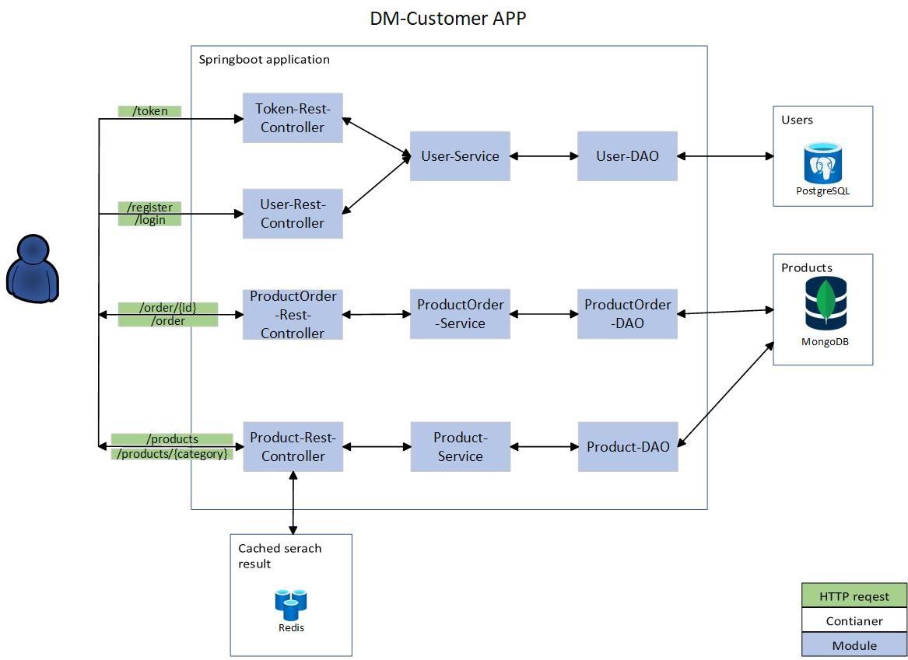

# DM-Customer APP

<p align="center"><b>
DM-Customer is a Spring Boot application that allows customers to place orders for paper products. The application is designed using the ports and adapters architectural pattern, enabling easy component exchange and integration with external systems. The aim of this project is to create an application where customers can browse available paper products, view their descriptions and prices. Registered users can place orders for selected paper products, specifying quantity and other order details.  
</b></p>

### After starting the project, API documentation is available at this address:

## Diagram

<p align="center">
  
</p>

## Table

<p align="center"><b> table with mappings soon</b></p>

## Tech STACK

### CI/CD 


### Code 

  

### Database 

  

### Frameworks

 

### Test 

   

### Others 

   


# Solved problems

Throughout the development of this project, I encountered various challenges and obstacles. Here are some of the key challenges I tackled:

- Structuring the codebase with independent modules to enhance maintainability and scalability.
  
- Implementing a design that promotes maximal encapsulation, reducing coupling and enhancing code reusability.
  
- Adhering to the Ports-and-Adapters architectural pattern to achieve a clean and modular architecture.

- Implementing authorization using JWT tokens and Spring Security to secure the application and protect sensitive data.

- Writing integration tests using TestContainers to verify the interaction between different components and ensure system stability.
  
- Stick to the SOLID, DRY, KISS rules

- Implementing continuous integration and continuous deployment (CI/CD) pipelines using Jenkins to automate the build, test, and deployment processes.

- Following the GitHub flow methodology for development, including feature branching, pull requests.

# How to build the project ?

## To build the project:

 1. Clone the repository:

  ```
  git clone https://github.com/KarolinaNPRCZ/DM-Customer.git
  ```
 2. Go to the folder with cloned repository
 
   Run the command:
   ```
   mvn package -DskipTests
   ```
   In folder target you should find a file named: application-{version}.jar
## To build the docker image with Docker Compose:

   1. Clone the repository:

   ```
   git clone https://github.com/KarolinaNPRCZ/DM-Customer.git
   ```
   2. Go to the folder with cloned repository

   
   3. Run the command:

   ```
   docker-compose build
   ```

## What I'm going to do in future
There are many things that I'm going to do in this project in the future. Few of them:

- Add order management required modules.

- Store products in cache.

- Fetch some papper products from external service.

- Email veryfication.


